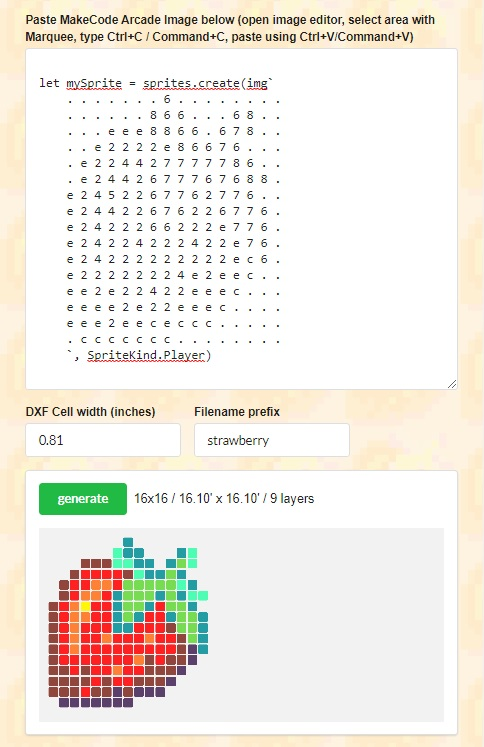

Use the [MakeCode Arcade Stencilr](http://arcade-stencils.glitch.me/) tool to create Stencils from your Arcade Sprites that you can use a laser cutter to create and then hand-color on paper, wood or other materials.

Alternately you can use the stencil images to create custom silkscreen shirts or posters.

