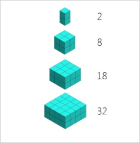

## Group Activity Worksheet - Computational Thinking

Computational thinking can be broken down into four universally recognized components:

1. Decomposition
2. Pattern recognition
3. Abstraction
4. Algorithms

### A. Computational Thinking in Your Daily Lives

Discuss where you practice computational thinking in your daily lives without even realizing it. The examples I gave you related to school work you may have done, you, of course, can include addtional school examples, but I also want you to go further than what you do in school. Where else do you practice these components? What are those examples?

| Daily Tasks | Computational Thinking Component |
|---|---|
| | |
| | |
| | |
| | |
| | |

### B. Applying What You Learn

Pick one or more of the following challenges to complete as a group.

#### 1. **Decomposition** - the ability to break a larger problem down into smaller parts

_Mary had a bad day. She woke up late, didn’t have any clean clothes so had to borrow her older brother's
clothes which were too big for her. She didn’t have any more of her favorite cereal, so she had to eat oatmeal
for breakfast which she hated. This put her in a bad mood, so she yelled at her little sister and made her cry.
She stormed out of the kitchen and forgot her homework on the kitchen table. As she was running to catch
the bus, she tripped on her brother's too-large pants and fell — skinning her knee and missing the bus. She
walked to school which made her late to class so she missed an opportunity to sign up for the extra credit she
needed to bring her grade up to a C...._

"Decompose" the above situation into multiple, smaller independent problems that Mary could solve to
have a better day tomorrow.

| Problem | Potential Solution |
|---|---|
| Waking up late  | - Set multiple alarms - Ask her brother to wake her up  - Go to bed earlier |
| | |
| | |

#### 2. **Pattern recognition** - being able to identify similarities within problems

Solve the following puzzles:

1. What is the next term? 18, 15, 12, 9, ....
2. What comes next? 10, 18, 13, 21, 16, 24, 19, 27, ...
3. What comes next?

4. What number goes in the blank? __, 5,9, 17, 29, 45, ...
5. What goes in the blank? HINT: Thinking Rounding 
41.3 --> 4   &nbsp;30.1 --> 3 
56.1 --> 6   &nbsp;44.33 --> 4 
78.28 --> 8  &nbsp;29.18 --> 3 
24.44 --> 2  &nbsp;56.11 --> __

(If you want to do more pattern puzzles at a later time, check out [BrainGymmer](https://www.braingymmer.com/) or [Brilliant](https://brilliant.org/).)

#### 3. **Abstraction** - conceptual process where general rules and concepts are derived from usage and classification of specific examples

For each of the following examples, extract out the general rule that could be applied to multiple different situations.

| Specific situation | Abstraction |
|---|---|
| On Tuesday, David was wearing a blue shirt and cutting carrots in his warm kitchen when he closed his eyes and cut his finger. | - When cutting things, it's best to keep you eyes open - Knives are sharp and can harm you |
| Last week, Marie was entering her house from walking her dog, Max, when the phone rang. She hurriedly answered the phone. Max jumped onto a chair, and when Marie motioned for Max to get down, Max's leash got caught in the chair, hurting him. | |
| Joseph is runs hurdles for his school’s track team. Practices start every afternoon at 4 p.m. The team, however, warms up at 3:30 p.m. Every Tuesday, Joseph misses warm-ups, and he has very little to eat or drink because he has a club meeting during lunch and right after school. He cramps up and cannot finish his practice on Tuesdays. The rest of the week, he has no problems with the workout set for the day. | |

#### 4. **Algorithmic thinking** - when you develop a step-by-step process or rules to follow to solve a problem

Write algorithms to accomplish the given task:

| Task | Algorithm |
|---|---|
| Navigate a maze | Perform the following steps: 1. Move forward as far as you can 2. If you can't move, turn right 3. If there is no wall in front of you, go back to step 1 4. Otherwise, turn left twice  | 5. If there is no wall in front of you, go back to step 1 |
| Go on a date | |
| Tie a shoe | |
| Raise your hand in class | |

### Challenge Question

The first 4 Fibonacci numbers are 0, 1, 1, and 2, what is the twelfth number?

1. 55
2. 77
3. 88
4. 89