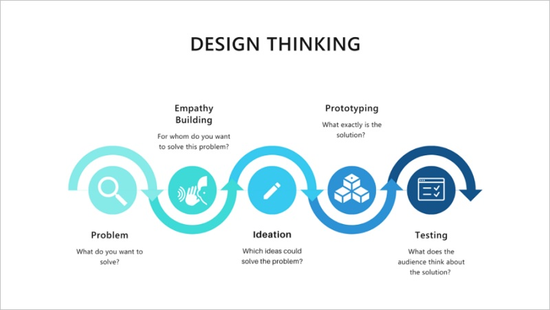

Use the design thinking process to create the perfect house for your client.

## 1. Identify the client

List your target audience here. This can be friends, family, pets – be as specific as possible.
  

## 2. Collect data

Interview your client to understand their needs/preferences. Use questions such as:

* Do you like large or small spaces?
* Do you like light or dark areas?
* Do you like privacy or shared spaces?
* How much time do you spend outdoors?
* Are you more comfortable in hot or cold temperatures?
* What is your daily routine?
* Do you have any physical limitations?
* What do you like/not like about your current house?

## 3. Create multiple different ideas

Using rough sketches, create a few different ideas and options for your client and present them to understand which qualities/features of your ideas your client prefers. Think big! Do not constrain yourself at this stage, and do not spend too much time creating these sketches – at this stage, the ideas should convey only the minimum details.

## 4. Create a prototype

Using the medium of your choice, create a prototype house that meets all the criteria specified by your client. You can create this prototype using:

* A drawing
* Paper structures
* Legos
* Minecraft
* Other...

## 5. Test 

Give your client a tour of your prototype house. Ask for feedback – what does the client like/not like about your model?