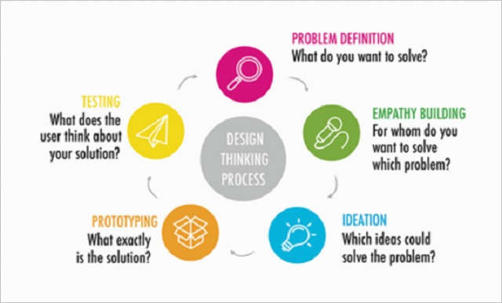

If you have micro:bits, students can create a micro:pet for a friend or family member.

Use the Design Thinking process to create a micro:pet for your client.

## 1. Who is the Client?

List your target audience here. This could be friends, family, pets – be as specific as possible.
  

## 2. Collect data

Interview your client to understand their needs/preferences. Use questions such as:

* Do you have a pet?
* What is it?
* What do you like about your pet?
* What do you dislike?
* Is there anything you wish your pet could do?
* Why?
* Tell me about your ideal pet. 

## 3. Create multiple different ideas

Using rough sketches, create a few different ideas and options for your client and present them to understand which qualities/features of your ideas your client prefers. Think big! Do not constrain yourself at this stage, and do not spend too much time creating these sketches – at this stage, the ideas should convey only the minimum details.

## 4. Prototype

Using the medium of your choice, create a prototype micro:pet that meets all the criteria specified by your client.

## 5. Test

Show your client the micro:pet. Ask for feedback – what does the client like/not like about your model?
