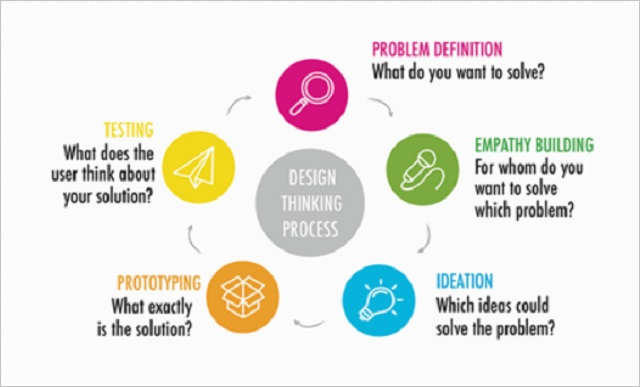

## Discover

Explain why you and your partner selected your target audience, and how you decided on the problem definition.    

## Ideation

During the ideation stage, how did you work together to brainstorm solutions? Was it easy to come up with ideas? Did you struggle to move beyond the most obvious solutions? What did you learn about ideation?    

## Prototype

Explain why you chose this idea over the other ones you had brainstormed to create a prototype? What challenges did you have while creating your prototype? What do you feel you and your partner did well during the prototyping stage? What did you learn about prototyping?    

## Test

Explain what happened when the other group tested your prototype. What worked well? What questions arose about your prototype? What did you learn from seeing someone else interact with your prototype?    

## Reflect and Refine

Explain how you modified your prototype after the feedback you received.    

## The Design Process

Explain what you have learned about the design process by completing this design challenge. Would you do anything differently next time? If so, what?    

## Collaboration

Do you feel you and your partner collaborated successfully? If so, why? If not, why not? What value did the collaboration bring to the challenge?  How could you have improved your collaboration?    

