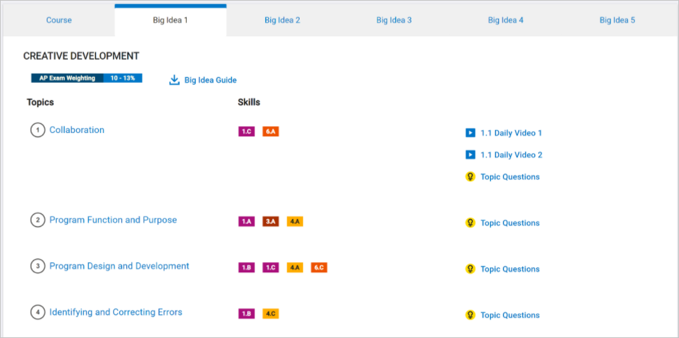
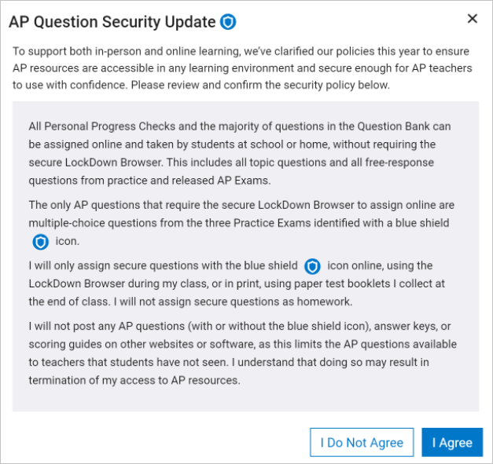
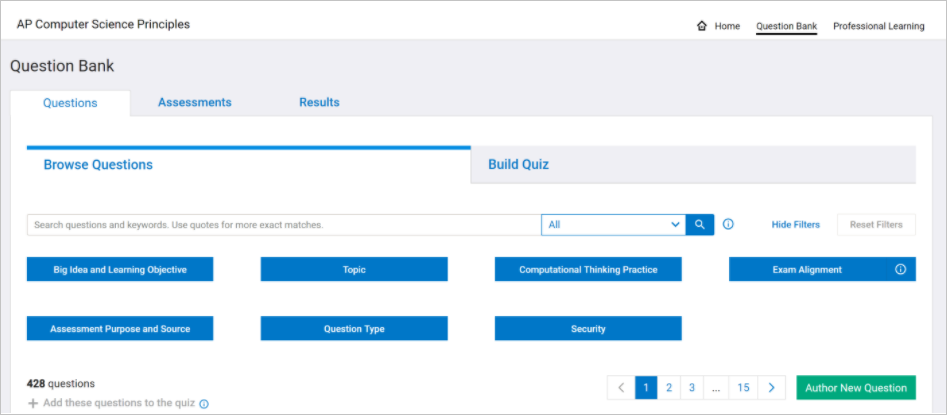

Unit 1 is an introductory unit that provides students with an overview of the course and introduces them to concepts related to Topic 1.1 (Collaboration) and Topic 1.3 (Program Design and Development) Topic Questions. Here is a guide as to when you can plan to include formative assessment questions on these topics in Unit 1:

* You can assign the 1.1 Collaboration questions anytime after Day 5.
* You can assign the 1.3 Program Design and Development related to the benefits of an incremental and iterative development and best practices in program development anytime after Day 10.

There are a variety of ways you can assign the questions to students. Options include:

1. Select one question a day as a bell ringer.
2. Assign questions without a blue shield for homework.
3. Create a quiz of all the relevant questions and designate a specific day for students to complete the formative assessment quiz.

To access topic questions for formative assessment during this unit, login to [AP Classroom](https://myap.collegeboard.org/login). Once logged in, you will see two options for finding resources to prepare students:

* Go to AP Classroom
* Question Bank

When you select AP Classroom, you will see course-level resources for both you and your students,

and a section for each Big Idea. The section for each Big Idea has a link to the course framework for that specific Big Idea Topic.

When you select a Topic Question link for the first time, you will likely see the following message:

This message can guide you on when and how you provide students the formative assessment questions.

When you select the Question Bank, you have the ability to find questions and build a quiz from your selected questions.

You can sort questions by Big Idea and Learning Objective, Topic, Computational Thinking Practice, and Question Type. Once you find questions you want to share with your students, select Add

and then name the quiz and select Create Quiz.

