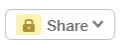
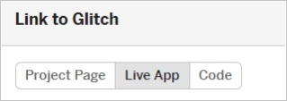
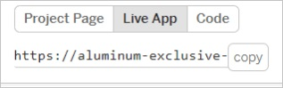

<Info>
Note to educator - place this in the Collaboration Space of your Notebook (or in another collaborative location) for student groups to easily access.
</Info>

You need to create a link that allows others to view your webpage. Follow these steps to create a view link:

1. You need to be logged in and working on your webpage in Glitch.

2. Select the Share button in the top left corner of your project.

3. Select the Live App button from in the "Link to Glitch" section.

4. Select the copy button by the link that appears below the Live App button.

5. Enter your link for the proper item here:

    * **Network Nodes**: 
    * **Internet**: 
    * **WWW**: 
    * **Data Transfer**: 
    * **Protocols**: 
    * **Fault Tolerance**: 
    * **Parallel Computing**: 
    * **HTML**: