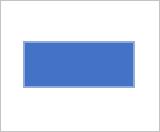
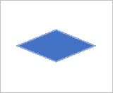
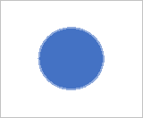
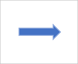

## Flowcharts

Flowcharts are a diagrammatic representation of an algorithm. They are helpful for writing programs and explaining your program to others.

Create a visual representation of how to count the people in the room using flowchart symbols.

### Teminator

The start or end of the program.

### Process

Used for arithmetic operations and data-manipulations.

### Decision

Used for decision making between two or more alternatives.

### Data

Indicates information entering or leaving the system- inputs and outputs.

### On-Page Reference

Contains a letter inside. Indicates that the flow continues at matching symbol containing the same letter somewhere on the same page. 

### Off-Page Reference

Contains a letter inside. Indicates that the flow continues at a matching symbol containing the same letter somewhere on a different page. 
  

### Predefined Process

Group of statements performing one processing task.

### Flow Line

Group of statements performing one processing task.

## Group activity

If you have time after writing an algorithm for adding the ages of everyone in the room, create a visual representation of your algorithm using flowchart symbols.