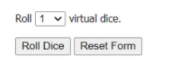

Each person will use one die. You can either use a physical die that I provide, or you can use a [virtual die](https://www.random.org/dice/). If you choose to use the [virtual die](https://www.random.org/dice/) be sure to change the number of die rolled from 2 to 1.

Once you are ready, one person will roll the die 15 times while the other person records the number generated by the roll. After 15 times, switch rolls and roll the die 15 more times. Record your results here:

| Roll number | Result of the roll |
|-------------|--------------------|
| 1 | |
| 2 | |
| 3 | |
| 4 | |
| 5 | |
| 6 | |
| 7 | |
| 8 | |
| 9 | |
| 10 | |
| 11 | |
| 12 | |
| 13 | |
| 14 | |
| 15 | |
| 16 | |
| 17 | |
| 18 | |
| 19 | |
| 20 | |
| 21 | |
| 22 | |
| 23 | |
| 24 | |
| 25 | |
| 26 | |
| 27 | |
| 28 | |
| 29 | |
| 30 | |

Now, count the frequency for each number and enter your results here:

| Number on the die | Number of times we rolled that number |
|---|---|
| 1 | |
| 2 | |
| 3 | |
| 4 | |
| 5 | |
| 6 | |
