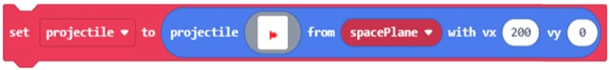
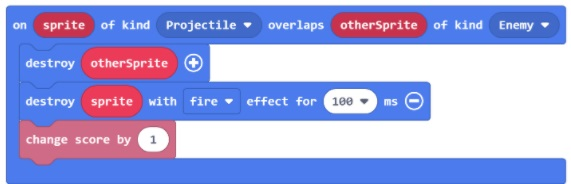
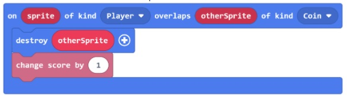
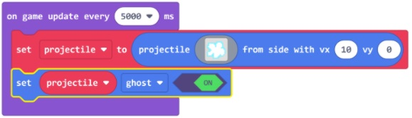

## Go to Activity: Projectiles from Sprites.

Complete student tasks 1 and 2.

### Tasks

#### Task 1

* Modified code to make a target sprite on the other side of the screen from the player sprite.
* Added a countdown timer.
* Created an on overlap event for the ball and the target to add a point and destroy the ball.

**Shared Project**: [Throw Ball](https://arcade.makecode.com/78411-84544-86314-39218)

#### Task 1 Challenge

* Made the target into projectiles that move down the screen and added vertical motion to the player sprite.

**Shared Project**: [Throw Ball Challenge](https://arcade.makecode.com/70637-81809-21861-16121)

#### Task 2

* Created a projectile that moves across the bottom of the screen that, while moving, gives off different projectiles that “float” to the top of the screen.

**Shared Project**: [Projectile from bottom](https://arcade.makecode.com/01760-33269-79625-88543)

#### Task 2 Challenge

* Made the projectile "float" up from the bottom of the game screen and give them a small random X direction so they move at a slight angle left or right.

**Shared Project**: [Projectile from bottom random](https://arcade.makecode.com/49142-97487-27824-43453)

### Questions

Answer the following reflection questions regarding the projectiles from sprites activities:

1. How can we make a sprite move from another sprite? Explain the block code to use.
2. Give examples of using on overlap events in a game to make projectiles that are decorations, laser beams, and coins. Explain each.
3. Create a hypothesis about why it might be useful to make projectiles have ghost on.

## Activity Solutions

Answer the following reflection questions regarding the projectiles from sprites activities: 

1. How can we make a sprite move from another sprite? Explain the block code to use.

2. Give examples of using on overlap events in a game to make projectiles that are decorations, laser beams, and coins (reward). Explain each.

* Decorations - No overlap event, sprites should just pass through.
* Laser beams - Shooting from a ship into an obstacle should destroy the obstacle and the projectile and give you a point.

* Coins - you collect the coins and earn points.

3. Create a hypothesis about why it might be useful to make projectiles have ghost on:

* When a projectile has its property ghost set to On, that means Sprites can pass right through it. This is useful if you are using projectiles as decorations - when you don't need to use an On Sprite Overlap Event Handler block. If a projectile is a ghost, then the Overlap event won't be triggered.

