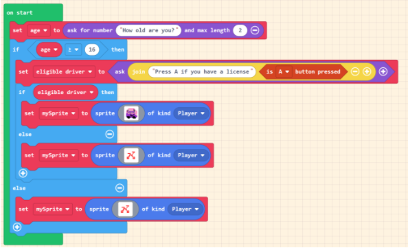
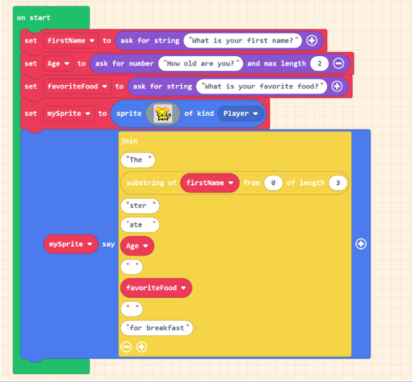

## A. Complete the following for each code segment:

1. Code Tracing: Review the program and determine what the program does. Write an explanation of what the code does in the appropriate column. (Notes: Be sure to use accurate descriptive words (ex: input, output, etc.) in your explanations.)

2. Use JavaScript to rewrite the code segment. When you are finished rewriting the code, publish your project and paste the link in the space provided in the chart.

### Code Segment 1

#### Write an explanation of what this code does

      

#### My rewrite in JavaScript

      

### Code Segment 2

#### Write an explanation of what this code does

      

#### My rewrite in JavaScript

      

## B. Reflection: After running your completed program, write responses to the following questions

1. Was your coding tracing correct? If not, what did you miss?

2. Compare the block code to the JavaScript code. What differences do you notice?
