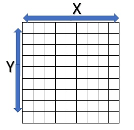
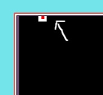
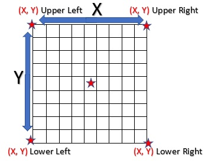
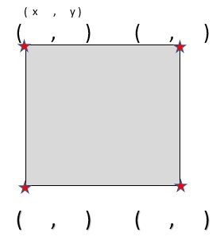

If you want students to work through an activity to learn about the coordinates in MakeCode Arcade, you can share the coordinate-walker code with them and then ask them to answer the questions below the embedded program.

[coordinate-walker](https://arcade.makecode.com/15642-79201-02526-07359)

Two dimensional game screen coordinates are represented by values for X and Y axis locations.

Using the coordinate-walker program above, move to the sprite to the top edge of the screen 

* What is the Y coordinate at the top of the screen?

Now, Move to each of the corners and map the coordinates as a pair of X and Y values like (X, Y): 

* Restart the game. What are the coordinates at the start?
* Record what the coordinates at the Top Right corner are
* Record what the coordinates at the Bottom Right corner are
* Record what the coordinates at the Bottom Left corner are
* Record what the coordinates at the Top Left corner are
* Record what the Game Screen Dimensions (height by width) are

Record the results from this task in a simple diagram like the one below.

