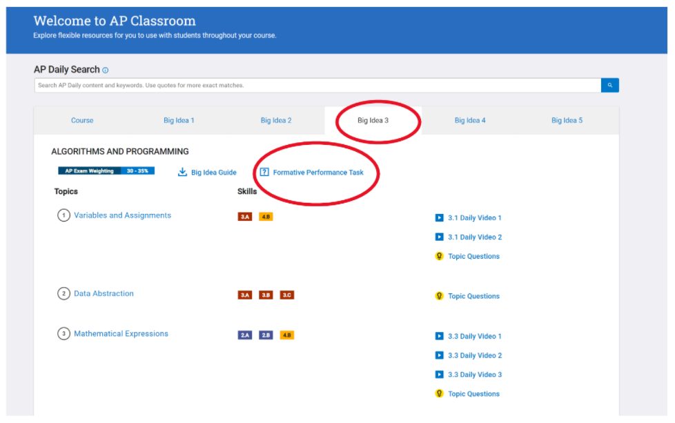
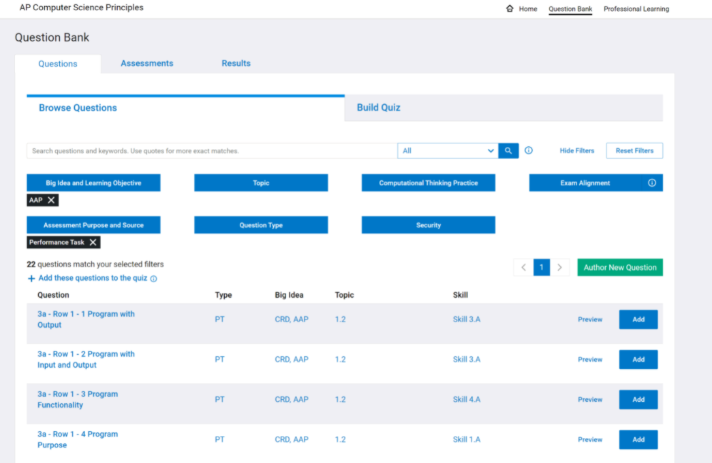

Unit 3 is an introduction to Algorithms and Programming and covers concepts related to Topic 3.1 (Variables and Assignments), Topic 3.3 (Mathematical Expressions), Topic 3.4 (Strings), Topic 3.5 (Boolean Expressions), Topic 3.6 (Conditionals), Topic 3.7 (Nested Conditionals), Topic 3.8 (Iteration), Topic 3.9 (Developing Algorithms), and Topic 3.15 (Random Values) Topic Questions. Here is a guide as to when you can plan to include formative assessment questions on these topics in Unit 3: 

* You can assign the 3.9 Developing Algorithms questions anytime after Day 3.
* You can assign the 3.1 Variables and Assignments & 3.3 Mathematical Expressions questions anytime after Day 9.
* You can assign the 3.4 Strings questions anytime after Day 10.
* You can assign the 3.5 Boolean Expressions questions anytime after Day 11.
* You can assign the 3.6 Conditionals and 3.7 Nested Conditionals questions anytime after Day 12.
* You can assign the 3.15 Random Values questions anytime after Day 14.
* You can assign the 3.8 Iteration questions anytime after Day 15.

**Because this unit is an introduction to Algorithms and Programming, we recommend that you select the easier questions at the beginning of the unit and then you can select some of the more challenging ones closer to the end of the unit. You can hold the remaining challenging questions for Unit 5.

There are a variety of ways you can assign the questions to students. Options include:

1. Select a few questions a day as a bell ringer.
2. Assign questions without a blue shield for homework.
3. Create a quiz of a portion of the relevant questions and designate a specific day for students to complete the formative assessment quiz.

You can access topic questions for formative assessment during this unit in the same way you did for Unit 1 and 2 by logging in to [AP Classroom](https://myap.collegeboard.org/login) and selecting the Question Bank in AP Classroom.

Additionally, when you assign the following projects, you can assign Performance Task writing prompts within AP Classroom:

* <a href="/unit-3/day-9/my-20percent-tip-app">My 20% Tip App</a>
* <a href="/unit-3/day-9/military-time-converter">Military Time Converter</a>
* <a href="/unit-3/day-12/putting-together">Putting it all together Project</a> (Conditional Statements project)
* <a href="/unit-3/day-19-22/projects-requirements-responses">Project Requirements & Responses</a> (Unit 3 Culminating Project)

To access formative performance task prompts during this Unit, login to AP Classroom. Once logged in, you will see two options for finding resources to prepare students:

* Go to AP Classroom
* Question Bank

Select Go to AP Classroom and then select Big Idea 3. Once you select Big Idea 3, select the Formative Performance Task link.

Once you select the Formative Performance Task link, you will have a filtered list of the 22 Performance Task prompts that you can assign students.

You can preview the questions that work for the assignment and add them to a new quiz just like you created other formative assessments in this Unit and in Units 1 and 2.
