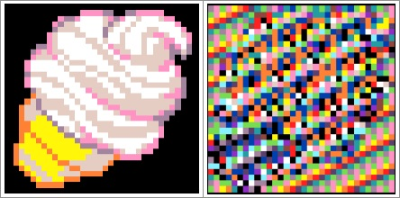

[Vigenere encode decode program - MakeCode.com](https://arcade.makecode.com/87951-72279-92245-16991)

* This program uses a Vigenère cipher to encode an image and decode the image.
* At the top of the screen is the color pattern which is used as the encryption key.
* Press button A to 'encrypt' the image.
* How good is this encryption?  Can you still recognize the image once it's encrypted? Or not?
* Press button B to 'decrypt' the image.
* Read the code and see if you can understand what it's doing.
* Use the debugger/"slo-mo" to see how the program is stepping through lines of code.
* Change the Sprite image (pick a different image from the Gallery or draw your own).
* Change the Password color pattern - pick fewer colors.
* See if your neighbor can correctly identify the image.
* Now change the Password color pattern again - this time pick more colors.
* Now see if your neighbor can identify the image.
* What does this tell you about the importance of a strong password?