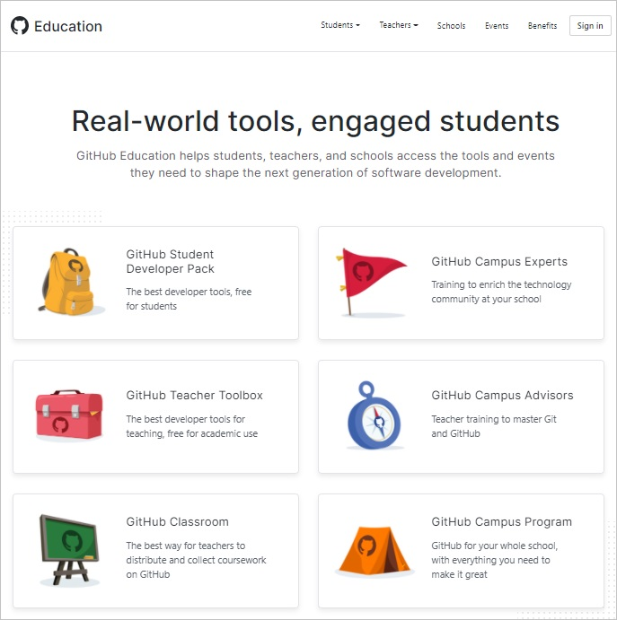

Note that GitHub has a wide range of Education-focused products, programs, and offers at [Github.com Teacher Guide](https://education.github.com/).

We will not be utilizing [GitHub Classroom](https://classroom.github.com/) or any of the other Education-focused products in this course. However, you are free to explore the offerings on your own.

GitHub Classroom in particular may be helpful for some educators to be able to create MakeCode Arcade programming assignments and manage student submissions - [Code in the browser with github classroom](https://github.blog/2020-05-26-code-in-the-browser-with-github-classroom/).

More information about how to use GitHub can be found here:

[Getting started with GitHub](https://docs.github.com/en/github/getting-started-with-github)