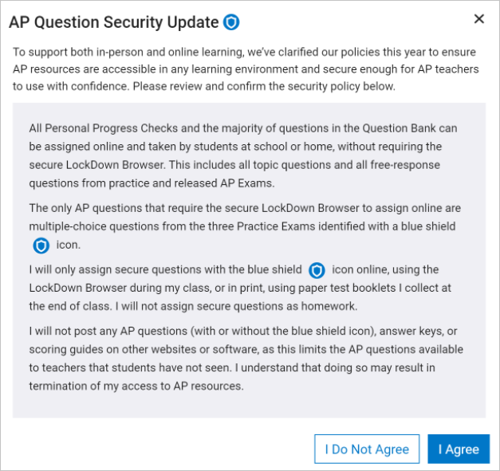
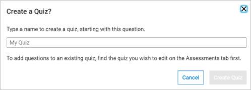

Unit 5 is an deeper exploration of Algorithms and Programming and covers concepts related to Topic 3.1 (Variables and Assignments), Topic 3.2 (Data Abstraction), Topic 3.3 (Mathematical Expressions), Topic 3.4 (Strings), Topic 3.5 (Boolean Expressions), Topic 3.6 (Conditionals), Topic 3.7 (Nested Conditionals), Topic 3.8 (Iteration), Topic 3.9 (Developing Algorithms), Topic 3.10 (Lists), Topic 3.11 (Binary Search), Topic 3.12 (Calling Procedures), Topic 3.13 (Developing Procedures), Topic 3.14 (Libraries), Topic 3.16 (Simulations), Topic 3.17 (Algorithmic Efficiency), and Topic 3.18 (Undecidable Problems) Topic Questions. Here is a guide as to when you can plan to include formative assessment questions on these topics in Unit 5:

* You can assign the 3.13 Developing Procedures questions anytime after Day 1.
* You can assign the 3.2 Data Abstraction questions anytime after Day 2.
* You can assign the 3.12 Calling Procedures questions anytime after Day 3.
* You can assign the 3.14 Libraries & 3.9 Developing Algorithms questions anytime after Day 4.
* You can assign the 3.5 Boolean Expressions, 3.6 Conditionals and 3.7 Nested Conditionals questions anytime after Day 6.
* You can assign the 3.8 Iteration & Topic 3.3 Mathematical Expressions questions anytime after Day 7.
* You can assign the 3.10 Lists, 3.1 Variables and Assignments, & 3.4 Strings anytime after Day 16.
* You can assign the 3.11 Binary Search questions anytime after Day 19.
* You can assign the Topic 3.16 Simulations, Topic 3.17 Algorithmic Efficiency, and Topic 3.18 Undecidable Problems questions at the end of the Unit (after Day 28).

There are a variety of ways you can assign the questions to students. Options include:

1. Select one question a day as a bell ringer.
2. Assign questions without a blue shield for homework.
3. Create a quiz of all the relevant questions and designate a specific day for students to complete the formative assessment quiz.

To access topic questions for formative assessment during this unit, login to [AP Classroom](https://myap.collegeboard.org/login). Once logged in, you will see two options for finding resources to prepare students:

* Go to AP Classroom
* Question Bank

When you select AP Classroom, you will see course-level resources for both you and your students,

and a section for each Big Idea. The section for each Big Idea has a link to the course framework for that specific Big Idea Topic.

When you select a Topic Question link for the first time, you will likely see the following message:

This message can guide you on when and how you provide students the formative assessment questions.

When you select the Question Bank, you have the ability to find questions and build a quiz from your selected questions.

You can sort questions by Big Idea and Learning Objective, Topic, Computational Thinking Practice, and Question Type. Once you find questions you want to share with your students, select Add

and then name the quiz and select Create Quiz.

