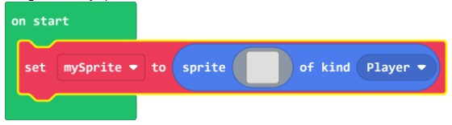
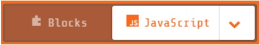
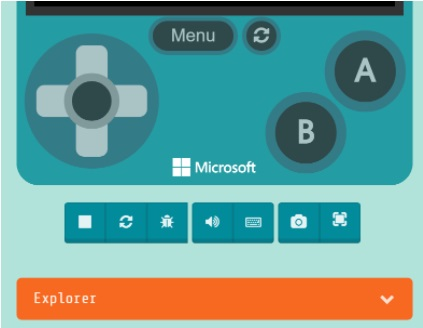
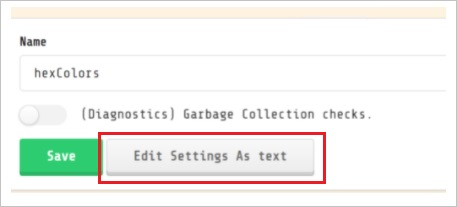
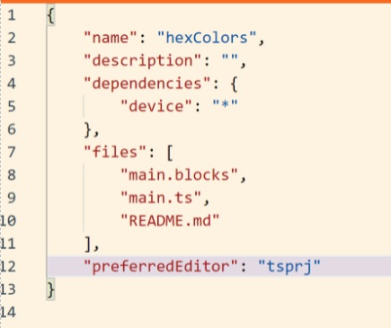
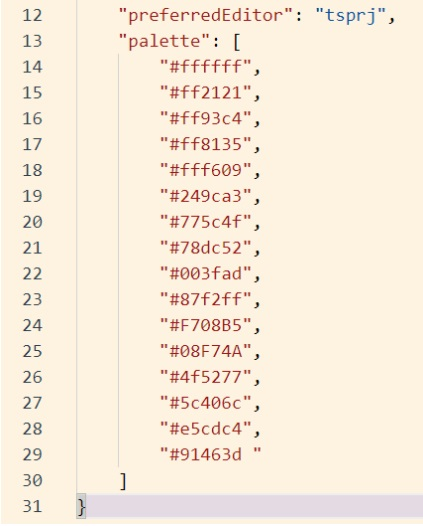
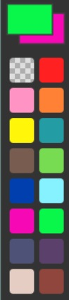
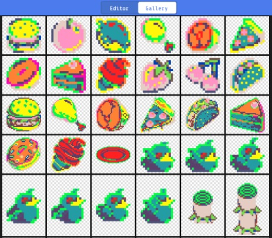

## Color Numbers

Find your favorite colors using the Canva Color Wheel. Record the hex-codes of those colors in your OneNote.

As you know from creating your sprites, MakeCode Arcade has a palette of 16 colors - 15 colors and transparent. What if you could add your favorite color to the palette?

1. Go to the [MakeCode Color Palette document](https://1drv.ms/w/s!AqsgsTyHBmRBkGjGeXdpq7UoOazc?e=NgS4cw).

2. Replace two (or more) of the colors with your favorite complementary colors from the Canva color wheel. Make sure there are no extra spaces before or after the # (pound sign) or " (quotes).

3. Open [arcade.makecode.com](https://arcade.makecode.com/), and start a new project called `myColors`.

4. Drag a Set mySprite block into the On Start block:

5. Switch to JavaScript:

6. Click to expand the Explorer pane under the simulator:

7. Click the `pxt.json` file and the click on **Edit Settingts As Text**.

8. Click after `tsprj` (after the closing quotes):

9. Type comma and hit enter

10. Copy your new color palette code from the Word document and paste it in here.  Make sure it is after the comma you just typed and before the closing curly bracket:

11. Click `main.ts` to refresh game:

12. Open up the Sprite Editor to draw your sprite and see the new colors!

13. Click on the Sprite Gallery to see how your palette mods changed the other sprites in the gallery!

Note that this custom color palette only impacts the current project.  And you must be in JavaScript to access the file Explorer.

### Learn more

* Arcade Colors and Images: [MakeCode.com Developer Images](https://arcade.makecode.com/developer/images)
* Color Palettes: [Adafruit color palattes for MakeCode Arcade](https://learn.adafruit.com/custom-color-palettes-for-makecode-arcade-games/color-palettes)
* And custom palettes in MakeCode Arcade: [Adafruit custom color palattes for MakeCode Arcade](https://learn.adafruit.com/custom-color-palettes-for-makecode-arcade-games/custom-palettes-in-makecode-arcade)