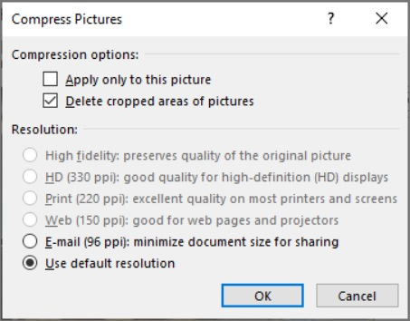
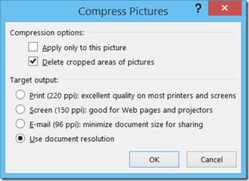

## Word Document Size

Clipped from: [Microsoft support: how do reduce the file size of your Word documents](https://support.microsoft.com/en-us/topic/reduce-the-file-size-of-your-word-documents-6c5a1186-6353-453d-bb22-e9322c2cfbab?ui=en-us&rs=en-us&ad=us). If the file size of your Word document is too large, try the following tips to make it more manageable.

### Compress pictures - 1

1. Select a picture in your document. Note that the **Picture Format** tab becomes available.
2. On the **Picture Format** tab, in the **Adjust** group, select **Compress Pictures**.
3. Under **Compression options**, do either of the following:
    * Make sure that **Apply only to this picture** is not selected so that the changes you make here will apply to all pictures in the document.
    * Select **Delete cropped areas of pictures**. This option removes the cropped picture data but note that if you delete the cropped picture data, you won't be able to restore it.

4. Under **Resolution**, select **Use default resolution**. This option uses the default resolution you set in **File > Options > Advanced**.

### Compress pictures - 2

1. Select a picture in your document, and then click the **Format** tab. 
2. **Select Compress Pictures**. 
3. In the **Compress Pictures** dialog box, do any of the following:
    * Make sure that **Apply only to this picture** is not selected so that the changes you make here will apply to all pictures in the document.
    * Select **Delete cropped areas of pictures**. This option removes the cropped picture data but note that if you delete the cropped picture data, you won't be able to restore it.

 

4. Under **Target output**, select **Use document resolution**. This option uses the default resolution you set in **File > Options > Advanced**.