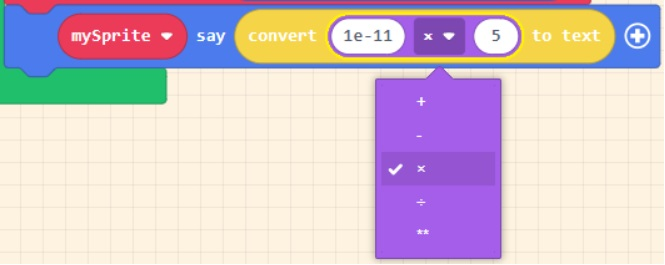

The following MakeCode Arcade programs can help you see approximation and overflow errors in action.

## Floating Point and Overflow

[Floating Pt and Overflow](https://arcade.makecode.com/91059-73720-99053-35862)

Click on **Edit Code** to open the program. 

When you run this program, it is dividing 17 by 5 and displaying the result.

1. Replace the 17 with 3.4. What is the calculation now? **Answer**: 0.67999999999999999
2. Perform the same calculation on a calculator. What is the answer? **Answer**: 0.68
3. Why do you think they are different? **Answer**: Different precision levels
4. Replace 3.4 with it with 0.00000000001.  What is the calculation now? **Answer**: 2e-12 the numbers after the ‘e’ are an exponent of 10
5. Now, change the calculation to a multiplication rather than division.

Once you change to multiplication change the number to calculate a large number. Keep changing the numbers until it reaches overflow. 

6. Now try using the myint and myfloat variables in your calculation.  Hint - look in the Variables Toolbox drawer. **Answer**: Floating point 534.96

Is the result an integer or a floating point number? 

7. From the Info Toolbox drawer, pull out a Set Score block and place after the mySprite Say block. From the Text Toolbox drawer, pull out a Parse to Number block and place in the Set Score block.  In the Parse to Number block type "7.5e2".

What happpens? **Answer**: Displays a score of 750 because 7.5 x 10^2 = 750 MakeCode Arcade Parse Float  

## Approximation

[Approximation](https://arcade.makecode.com/72025-07610-61996-61039)

Click on **Edit Code** to open the program.

1. What is the value of x? **Answer**: 0.8

2. What is the value of y? **Answer**: 0.8

3. According to the algorithm, is the program correct, when it displays "False"? **Answer**: No - these are equivalent values so it should return True

4. Why or why not? What is going on? Hint: move the mySprite say block

out of the source code and replace it with the other disabled mySprite say block on the workspace

Use the drop-down menu to change the variables. **Answer**: The X variable value shows a 0.79999999 instead of 0.8.  This is an example of a precision rounding error.
