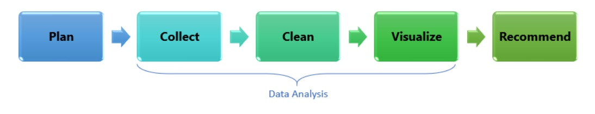

## The Data Science Process

**1. Plan** - What question to answer

**2. Collect** - obtain the data

**3. Clean** - verify you have 'good' data

**4. Visulize** - model the data to see patterns

**5. Recommend** - create suggestions/actions to take base on findings

Throughout your data research project, you will follow the data science process. Use this checklist to guide your work and make sure you are completing all the stages of the data science process.

### 1. Plan

* Identify the project goals:

&nbsp;&nbsp;&nbsp;&nbsp;:white_large_square: What topic will you research? Why? 

* Define the scope of the project:

&nbsp;&nbsp;&nbsp;&nbsp;:white_large_square: What data will you need? 
&nbsp;&nbsp;&nbsp;&nbsp;:white_large_square: Who will you need to collect data from? 
&nbsp;&nbsp;&nbsp;&nbsp;:white_large_square: Are there any considerations you need to take into account? Language? Survey access? 

* Plan the project:

&nbsp;&nbsp;&nbsp;&nbsp;:white_large_square: What steps need to be taken to complete the project? 
&nbsp;&nbsp;&nbsp;&nbsp;:white_large_square: How will you collect the data? 
&nbsp;&nbsp;&nbsp;&nbsp;:white_large_square: What will you do with the data? 

### 2. Collect

:white_large_square: Determine how many responses you need. 
:white_large_square: Formulate the questions for your survey. 
:white_large_square: Create the survey. 
:white_large_square: Consider any privacy or collection bias issues. 

### 4. Data Cleansing

:white_large_square: Inspect the data for any inconsistencies. 
:white_large_square: Amend or remove data because it is incorrect, incomplete, improperly formatted, or duplicated. 
:white_large_square: Organize or categorize the data if necessary. 

### 5. Action/Recommendations

:white_large_square: Implement actions, create recommendations and communicate your data study findings to others.