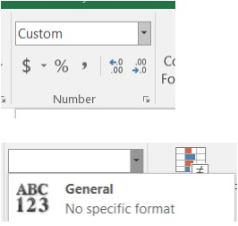

When you are looking to clean up your data, you can consult the following resource pages to help with that process. [Flash fill](https://support.microsoft.com/en-us/office/video-use-autofill-and-flash-fill-2e79a709-c814-4b27-8bc2-c4dc84d49464?ui=en-us&rs=en-us&ad=us) is a tool within Excel that can help you clean up your data. Learn more about flash fill [here](https://support.microsoft.com/en-us/office/using-flash-fill-in-excel-3f9bcf1e-db93-4890-94a0-1578341f73f7).

* Learn how to [Fill data automatically in worksheet cells](https://support.microsoft.com/en-us/office/fill-data-automatically-in-worksheet-cells-74e31bdd-d993-45da-aa82-35a236c5b5db).
* Learn how to [Split a column of data based on what you type](https://support.microsoft.com/en-us/office/split-a-column-of-data-based-on-what-you-type-27326b11-2358-432c-bf78-cf49621fe76d).
* Learn how to [Change the case of text](https://support.microsoft.com/en-us/office/change-the-case-of-text-01481046-0fa7-4f3b-a693-496795a7a44d).

Tip: When "cleaning" numbers, change the cell to:

When you analyze your survey results, you will have to determine what type of chart will be the best way to visually convey your findings. We will look at the first link together and discuss various chart types. Then, you can review the other links on your own after you download the Excel spreadsheet to help you analyze your data.

* A[vailable chart types in Office](https://support.microsoft.com/en-us/office/available-chart-types-in-office-a6187218-807e-4103-9e0a-27cdb19afb90)

* See more about adding [Charts](https://support.microsoft.com/en-us/office/create-a-chart-with-recommended-charts-cd131b77-79c7-4537-a438-8db20cea84c0?ui=en-us&rs=en-us&ad=us).
* See more about [sorting data](https://support.microsoft.com/en-us/office/quick-start-sort-data-in-an-excel-worksheet-60153f94-d782-47e2-96a8-15cbb7712539?ui=en-us&rs=en-us&ad=us).