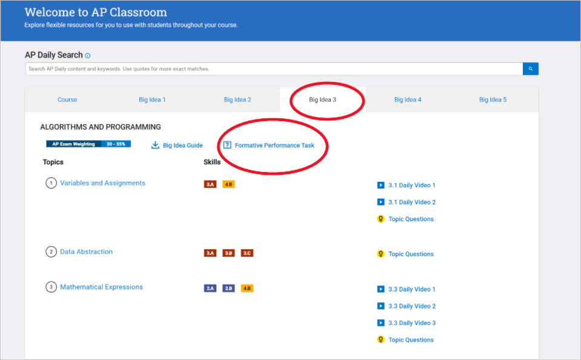
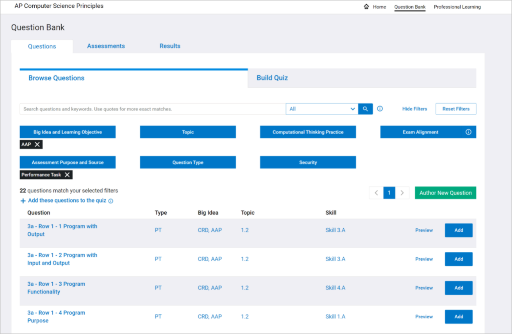

When you assign the Mock Create Performance Task, you can use Formative Performance Task writing prompts within AP Classroom to better prepare students for the Create Performance Task.

To access formative performance task prompts during this unit, login to [AP Classroom](https://myap.collegeboard.org/login). Once logged in, you will see two options for finding resources to prepare students:

* Go to AP Classroom
* Question Bank

Select Go to AP Classroom and then select Big Idea 3. Once you select Big Idea 3, select the Formative Performance Task link.

Once you select the Formative Performance Task link, you will have a filtered list of the 22 Performance Task prompts that you can assign students. Because students are completing a Mock Create Performance Task, you should assign all 22 questions by selecting the Add button and adding them to a "quiz" that you create similar to the way you have created formative assessments throughout the year.

