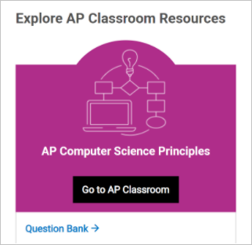
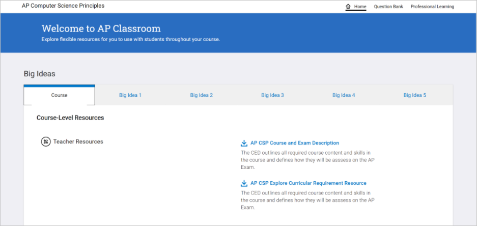
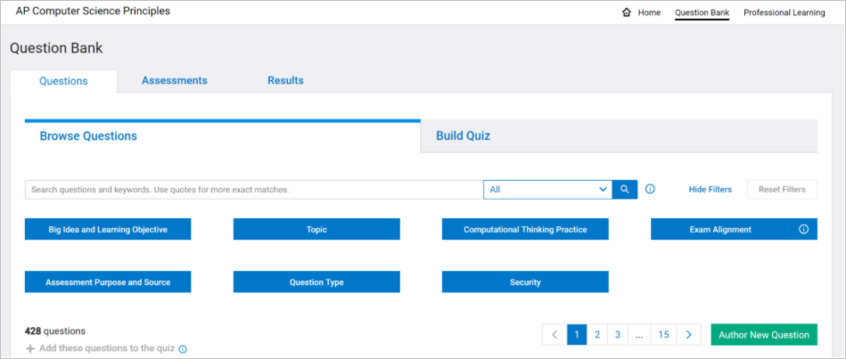
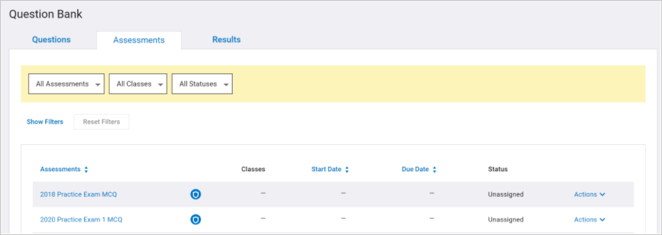

* Once your students are finished with the Create Performance Task, you will want to move to Exam preparation.
* If your students submit their Create Performance Task before your school's spring break, you will typically have at least three weeks of Exam preparation.
* Within those three weeks, you want to review concepts as well as assign exam practice questions to your students.
* Additionally, during your exam preparation time, you will want to schedule time for your students to take a complete mock exam.
* You can find a complete practice exam within the Assessments section of AP Classroom.
* A new version of a complete practice exam is typically available in early Spring.

Tips for the Mock Exam:

* Make sure students have the Exam Reference Sheets

To access practice exam questions, login to AP Classroom. Once logged in, you will see two options for finding resources to prepare students:

* Go to AP Classroom
* Question Bank

When you select AP Classroom, you will see course-level resources for both you and your students,

and a section for each Big Idea. The section for each Big Idea has a link to the course framework for that specific Big Idea Topic.

When you select the Question Bank, you have the ability to find questions and build a quiz from your selected questions.

When you select the Question Bank, you have the ability to find questions and build a quiz from your selected questions.

You can sort questions by Big Idea and Learning Objective, Topic, Computational Thinking Practice, and Question Type. Once you find questions you want to share with your students, select Add

and then name the quiz and select Create Quiz.

One possible way of reviewing for the Exam is to cover one Big Idea every two days: 

* Day 1 and 2 - Review CRD and complete CRD practice questions.
* Day 3 and 4 - Review DAT and complete DAT practice questions.
* Day 5 and 6 - Review AAP Part 1 and complete AAP Part 1 practice questions.
* Day 7 and 8 - Review AAP Part 2 and complete AAP Part 2 practice questions.
* Day 9 and 10 - Review CSN and complete CSN practice questions.
* Day 11 and12 - Review IOC and complete IOC practice questions.

Once, students have reviewed all of the content, you can schedule a Mock Exam:

You can access Practice Exams by selecting the Assessments tab.

* The Multiple Choice Exam is 2 hours.
* When you schedule a Mock Exam, you will need to divide the Mock Exam into three days.
* The exam has 70 multiple-choice questions.
* Students without extended time have 1.7 minutes per question; students with extended time testing have around 2.5 minutes per question.
* Therefore, if your students do not have extended time, you can give students 25 questions the first two days and 20 questions the last day to simulate the exam as best as possible.
* If you have students who qualify for extended time, you will need to allocate more days to your Mock Exam, and you can give them 18 questions the first three days and 16 questions the fourth day to simulate the timing of the exam.