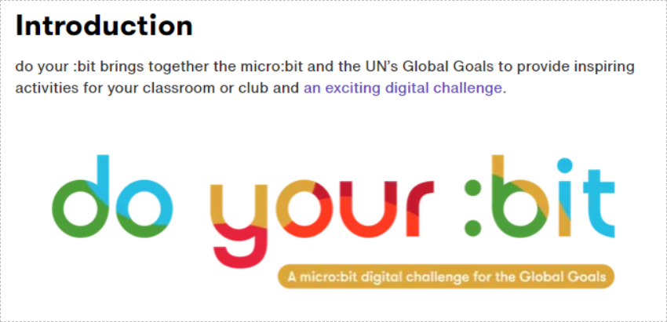
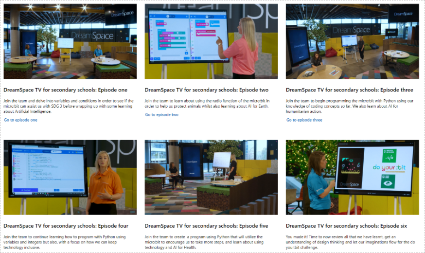

The Micro:bit Educational Foundation runs an annual competition called "Do Your Bit" which challenges students around the world to create a project using the micro:bit that aligns with one of the United Nations Sustainable Development Goals.

[micro:bit - do yor bit](https://microbit.org/projects/do-your-bit/)

There are a series of 6 video episodes with accompanying student worksheets and teacher guides which will walk students through using the micro:bit for projects related to the UN SDG's:

[DreamSpace TV](https://education.microsoft.com/en-us/resource/f7b52fd4)